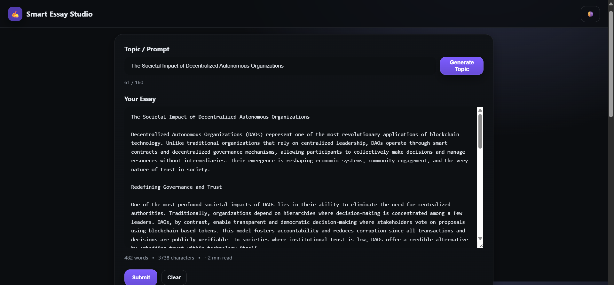
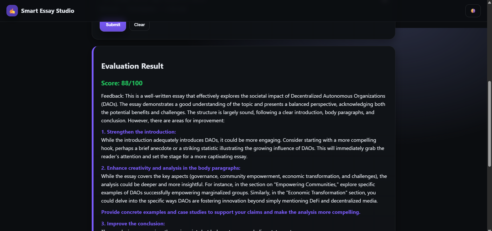

# 📝 Smart Essay Studio  

Smart Essay Studio is an **AI-powered essay writing and analysis platform** built with **Gemini 1.5 Flash**, **LangChain**, and **LangGraph**.  
It helps users generate essay topics, write essays, and receive AI-powered feedback & suggestions for improvement.  

---

## 🚀 Features  
- 🎯 Generate essay topics using **Gemini 1.5 Flash**  
- ✍️ Users can write essays directly in the app  
- 🔍 Essay analysis with **suggestions & improvement codes**  
- 🔄 Iterative workflow → write → analyze → improve  
- 🔑 API key security with `.env` file  
- 📂 Persistent topic tracking: Prevents repeating topics by storing previously generated ones in an external file.

---

## 🛠️ Tech Stack  
- **Frontend:** HTML, CSS, JavaScript  
- **Backend:** Flask (Python)  
- **AI/LLM:** Gemini 1.5 Flash (via LangChain + LangGraph)  
- **Environment Management:** `.env` file for API keys  

---

## ⚙️ Installation & Setup  

### 1. Clone the Repository  
```bash
git clone https://github.com/shashu7777/Smart-Essay-Studio.git
cd smart-essay-studio
```

### 2. Clone the Repository 
```bash
python -m venv venv
```
### 3. Install Dependencies
```bash
pip install -r requirements.txt
```
### 4. Set up Environment Variables
```bash
GOOGLE_API_KEY=your_api_key_here
```
### 5. Run the Server
```bash
python app.py
```

## 🖼️ Project Screenshots  

Screen shots of the pages 





